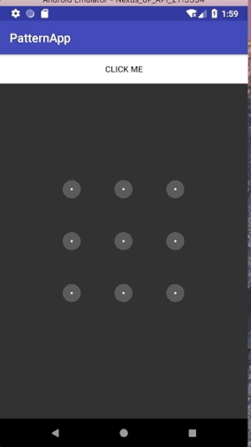

# 前言
1. 为什么会有这个项目呢？主要是经过大量的搜寻没有发现同时具有数字锁和手势锁的控件无奈写了个。
2. 考察kotlin书写复杂控件的舒适程度。
3. 这个项目的手势代码是借鉴别人的。由于转了几手，到我手里已不知原作者，故在这里先说明并道谢。

## 运行截图


## 使用方式
```groovy
implementation 'com.uchia.patternview:patternview:1.0.5'
implementation ‘org.jetbrains.kotlin:kotlin-stdlib-jdk8:1.2.40’
implementation ‘com.android.support:appcompat-v7:27.1.1’
```
**因为本库是用kotlin写的故还需依赖kotlin**

```xml

    <com.uchia.patternview.UltimatePatternView
        android:id="@+id/pattern_view"
        android:layout_width="320dp"
        android:layout_height="320dp"
        app:upv_gridRows="4"
        app:upv_gridColumns="3"
        app:upv_pathColor="@color/colorWhite"
        app:upv_pathWidth="3dp" />

```

手势锁完成回调
```kotlin 

    patternView.onPatternDetectedListener = object : UltimatePatternView.OnPatternDetectedListener{
            override fun onPatternDetected(result: String) {
                //todo
            }

        }

```

手势锁置为错误状态
```kotlin
    patternView.setDisplayMode(DisplayMode.Wrong)
```

数字锁按钮点击
```kotlin
        patternView.onPatternSelectedListener = object : UltimatePatternView.OnPatternSelectedListener {
            override fun onPatternSelected(content: String?) {
                content?.let {
                    //todo
                }
            }

        }
```

数字锁删除按钮事件注册
```kotlin
    patternView.registerClickEventByCell(3, 2, object :                 Cell.ClickListener {
            override fun click(cell: Cell) {
                //todo
            }

        })
```

数字锁删除按钮图标设置
```kotlin
patternView.deleteIcon = ***
```

## 属性说明
|属性名|作用|
|:--|:--|
|upv_gridRows| 设置锁的行数，如果需要混用数字手势锁请设为4，后期调整|
|upv_gridColumns|设置锁的列数，如果需要混用数字手势锁请设为3，后期调整|
|upv_pathColor|设置手势锁连线颜色|
|upv_pathWidth|设置手势锁连线的宽度|
|upv_number_textSize|设置数字锁文字的大小|
|upv_left_padding_ratio|设置锁的左边距，用于调整稀疏程度，范围为-1～1|
|upv_right_padding_ratio|设置锁的右边距，用于调整稀疏程度，范围为-1～1|
|upv_top_padding_ratio|设置锁的上边距，用于调整稀疏程度，范围为-1～1|
|upv_bottom_padding_ratio|设置锁的下边距，用于调整稀疏程度，范围为-1～1|
|upv_number_click_circle_radius|设置数字锁按下圆的半径|
|upv_number_click_circle_stroke|设置数字锁按下的圆描边的宽度|

## todo
1. 开放出更多的自定义属性
2. 取消混用的行列限制
3. 支持水波纹点击效果